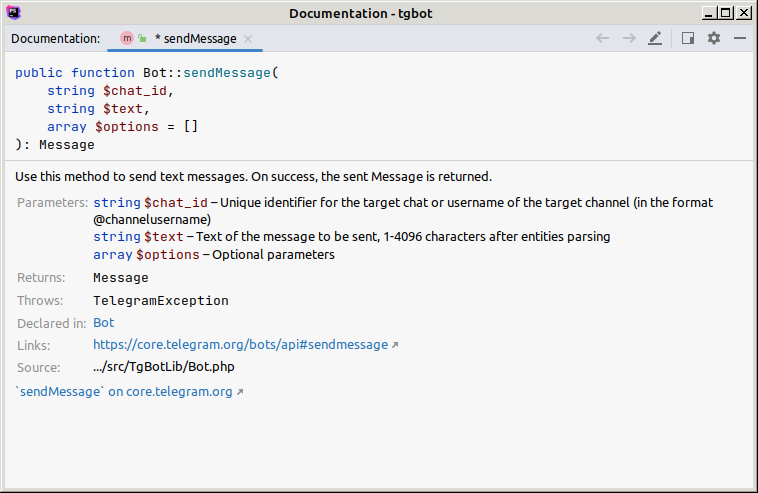

# TgBotLib

TgBotLib is a library for creating Telegram Bots in PHP, based on the [Telegram Bot API](https://core.telegram.org/bots/api).

The approach taken by this library is to be as close as possible to the Telegram Bot API, while providing a simple and
easy to use interface that is easy to understand and out of your way, allowing you to use the library as a simple
native around the API.

## Table of contents

<!-- TOC -->
* [TgBotLib](#tgbotlib)
  * [Table of contents](#table-of-contents)
  * [Versioning](#versioning)
  * [Installation](#installation)
  * [Compile from source](#compile-from-source)
  * [Requirements](#requirements)
  * [Usage](#usage)
  * [Documentation](#documentation)
  * [Single-Threaded & Multi-Threaded Bots](#single-threaded--multi-threaded-bots)
    * [Single-Threaded Bots](#single-threaded-bots)
    * [Multi-Threaded Bots](#multi-threaded-bots)
  * [Commands & Event Handlers](#commands--event-handlers)
    * [Commands](#commands)
    * [Event Handlers](#event-handlers)
* [License](#license)
<!-- TOC -->

## Versioning

The library's version is based on the version of the Telegram Bot API that it supports, for example, the version `6.5.0`
of the library supports the Telegram Bot API version `6.5` and patch version reflect the current patch version of the library.

To clarify, for example `6.5.4` means the library is based on the Telegram Bot API version `6.5` and the library's patch
version is `4`. Library patches are used to fix bugs or add improvements in the library, and are not related to the
Telegram Bot API version.


## Installation

The library can be installed using ncc:

```bash
ncc install -p "nosial/libs.tgbot=latest@n64"
```

or by adding the following to your project.json file under the `build.dependencies` section:
```json
{
  "name": "net.nosial.tgbotlib",
  "version": "latest",
  "source_type": "remote",
  "source": "nosial/libs.tgbot=latest@n64"
}
```

If you don't have the n64 source configured, you can add it by running the following command:
```bash
ncc source add --name n64 --type gitlab --host git.n64.cc
```


If you don't have ncc installed, you can refer to the [ncc documentation](https://git.n64.cc/nosial/ncc) for more
information on how to install it. See [Building NCC from source](https://git.n64.cc/nosial/ncc/-/blob/master/DOCUMENTATION.md#building-ncc-from-source)
and [Installing NCC](https://git.n64.cc/nosial/ncc/-/blob/master/DOCUMENTATION.md#installing-ncc) for more information.


## Compile from source

To compile the library from source, you need to have [ncc](https://git.n64.cc/nosial/ncc) installed, then run the
following command:

```bash
ncc build
```


## Requirements

The library requires PHP 8.0 or higher.


## Usage

 1. Import the library using `import('net.nosial.tgbotlib');`
 2. Create a new instance of the `TgBotLib\Bot` class, passing the bot token as the first argument
 3. Profit

```php
require 'ncc';
import('net.nosial.tgbotlib');

$bot = new TgBotLib\Bot('<BOT TOKEN>');

/** @var \TgBotLib\Objects\Telegram\Update $update */
foreach ($bot->getUpdates() as $update)
{
    $bot->sendMessage($update->getMessage()->getChat()->getId(), 'Hello World!');
}
```

Each method of the `TgBotLib\Bot` class is named after the corresponding method of the Telegram Bot API, all methods
contains an optional `$parameters` argument that can be used to pass additional parameters to the API method.

But for methods that has required parameters, the library provides a more convenient way to pass them, by using
named parameters. For example, the `sendMessage` method requires the `chat_id` and `text` parameters, but instead
of passing them as an array, you can pass them as named parameters:

```php
$bot->sendMessage(
    chat_id: '<CHAT ID>',
    text: 'Hello World!', 
    options: [
        'parse_mode' => 'Markdown',
        'disable_web_page_preview' => true,
    ]
);
```

## Documentation

Almost everything in the library has PhpDoc documentation, so you can use your IDE to get documentation for the
library. For example, in PhpStorm, you can press `Ctrl+Q` on a method to get the documentation for it:



## Single-Threaded & Multi-Threaded Bots

This part will explain how to implement single-threaded and multi-threaded bots using the library.
For more examples see the [tests](tests) directory.

### Single-Threaded Bots

To implement a single-threaded bot, it's very self-explanatory, you just need to create a new instance of the
`TgBotLib\Bot` class and use it to handle the updates:

```php
<?php

    // Import ncc
    require 'ncc';

    import('net.nosial.tgbotlib');

    // Require commands & event handlers
    require 'commands' . DIRECTORY_SEPARATOR . 'StartCommand.php';
    require 'commands' . DIRECTORY_SEPARATOR . 'HashCommand.php';
    
    // Create a new instance of the bot
    $bot = new TgBotLib\Bot(getenv('BOT_TOKEN'));

    // Loop forever
    while(true)
    {
        /** @var \TgBotLib\Objects\Telegram\Update $update */
        foreach ($bot->getUpdates() as $update)
        {
            $bot->sendMessage($update->getMessage()->getChat()->getId(), 'Hello World!');
        }
    } 
```

This approach is very simple and allows for easier debugging, but it's not recommended for production use, because
it will block the script until the updates are handled, and if the bot receives a lot of updates, it will take a
long time to handle them. So it's recommended to use a multithreaded approach for production bots.


### Multi-Threaded Bots

To implement a multi-threaded bot, you need to install [TamerLib](https://git.n64.cc/nosial/libs/tamer) which will allow
you to run parallel operations using a Message Server

First create a worker process that will handle the updates:

```php
<?php

    // Import ncc
    require 'ncc';

    // Import packages
    import('net.nosial.tgbotlib');
    import('net.nosial.tamerlib');

    // Require commands
    require 'commands' . DIRECTORY_SEPARATOR . 'StartCommand.php';
    require 'commands' . DIRECTORY_SEPARATOR . 'HashCommand.php';

    // Initialize the bot
    $bot = new TgBotLib\Bot('<BOT TOKEN>');

    // Setup command handlers
    $bot->setCommandHandler('start', new \commands\StartCommand());
    $bot->setCommandHandler('hash', new \commands\HashCommand());

    // Run TamerLib forever.
    \TamerLib\tm::initialize(\TamerLib\Enums\TamerMode::WORKER);
    \TamerLib\tm::addFunction('handle_update', [$bot, 'handleUpdate']);
    \TamerLib\tm::run();
```

Then create a master process that will send the updates to the worker:

```php
<?php

    // Import ncc
    require 'ncc';

    // Import packages
    import('net.nosial.tgbotlib');
    import('net.nosial.tamerlib');

    $bot = new TgBotLib\Bot('<BOT TOKEN>');
    \TamerLib\tm::initialize(\TamerLib\Enums\TamerMode::CLIENT);
    \TamerLib\tm::createWorker(8, __DIR__ . DIRECTORY_SEPARATOR . 'worker.php');

    // Handle updates forever
    while(true)
    {
        // Get updates, push the update object to the worker
        foreach ($bot->getUpdates() as $update)
        {
            \TamerLib\tm::dof('handle_update', [$update]);
        }
        
        \TamerLib\tm::wait(3);
    }
```

## Commands & Event Handlers

Commands and event handlers are a way to handle commands and events sent by the user, for example, when the user
sends the `/start` command, you can send a welcome message to the user.


### Commands

The library provides a way to handle commands and events using the `TgBotLib\Bot` class, for example, to handle
the `/start` command, you can use the `setCommandHandler` method:

```php
<?php
    require 'ncc';
    import('net.nosial.tgbotlib');

    $bot = new TgBotLib\Bot(getenv('BOT_TOKEN'));
    $bot->setCommandHandler('start', new \commands\StartCommand());
```

The `setCommandHandler` method takes two arguments, the first being the command name (without the `/` prefix), and
the second being a class that implements the `TgBotLib\Interfaces\CommandInterface` interface.

The interface has only one method, `handle`, which takes two arguments, the first being an instance of the
`TgBotLib\Bot` class which is used to invoke the API without having to recreate the instance, and the second being
the update object. The update object is an instance of the `TgBotLib\Objects\Telegram\Update` class, which contains
all the information about the update.

```php
<?php

    namespace commands;

    use TgBotLib\Bot;
    use TgBotLib\Interfaces\CommandInterface;
    use TgBotLib\Objects\Telegram\Update;

    class StartCommand extends CommandInterface
    {
        public function handle(Bot $bot, Update $update): void
        {
            $bot->sendMessage($update->getMessage()->getChat()->getId(), 'Hello World!');
        }
    }
```

### Event Handlers

Event handles are similarly implemented, but instead of using the `setCommandHandler` method, you use the
`setEventHandler` method:

```php
<?php

    require __DIR__ . DIRECTORY_SEPARATOR . 'autoload.php';

    $bot = new TgBotLib\Bot(getenv('BOT_TOKEN'));

    $bot->setEventHandler('message', new \events\MessageEvent());
```

And the interface EventInterface is used instead of CommandInterface:

```php
<?php

    namespace events;

    use TgBotLib\Bot;
    use TgBotLib\Interfaces\EventInterface;
    use TgBotLib\Objects\Telegram\Update;

    class MessageEvent implements EventInterface
    {
        public function handle(Bot $bot, Update $update): void
        {
            $bot->sendMessage($update->getMessage()->getChat()->getId(), 'Hello World!');
        }
    }
```


# License

This project is licensed under the MIT License - see the [LICENSE](LICENSE) file for details
